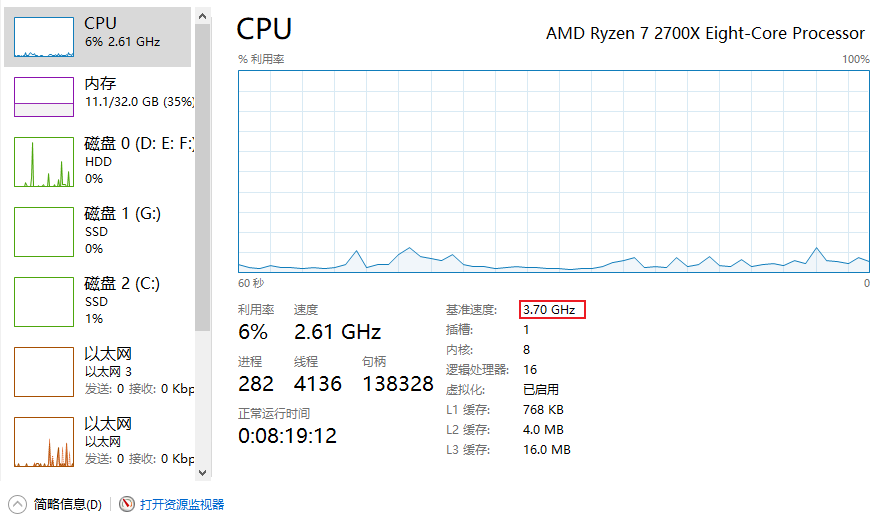
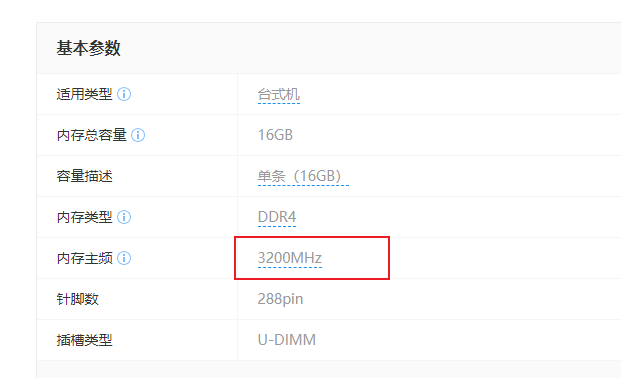

#### 1.1 冯诺伊曼计算机模型
cpu读内存存储，计算完之后，再存到内存存储。读数，存数.

cpu和内存通信是通过I/O总线，I/O是所有硬件都进行通信的，IO总线是有带宽的。而且内存的主频是远远小于CPU的速度。所以要有CPU Cache

寄存器>L1>L2>L3>内存条

cpu计算完之后，是先写到缓存里面来，什么时候写到内存呢？
当缓存不够用了，FIFO，清了写到内存里，把计算完的数据写回到内存，这个是不清楚的。等CPU有空的时候写到内存中。
有什么办法，强制让cpu写到内存中。就是#Lock信号。MESI缓存一致性协议，马上同步回来，就是用缓存一致性协议。

为什么要设计CPU缓存的原因是，cpu的读写速度是一般多少G的HZ，而内存是多少M的HZ，如果没有缓存，那cpu直接去读取内存，那内存是拖慢了cpu的计算速度，每次去读写内存中的数据，相对cpu来说都是浪费10被到百倍的速度。内存中的读写速度太慢了，跟不上cpu的运行速度，先把内存的指令码和数据段先读到cpu里面去运行。

cpu组成：控制单元、运算单元、存储单元

CPU多级缓存，寄存器
L1 cache
L2 cache
L3 cache

多核CPU和多CPU不一样，一个主板有多个槽位，可以放多个CPU。每个CPU会具体给你标明，每个CPU支持多少个线程，支持超线程。

缓存一致性协议

