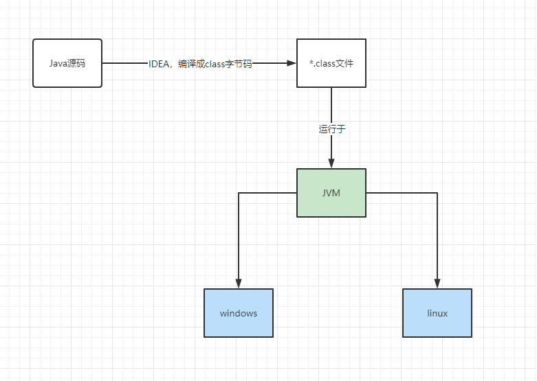
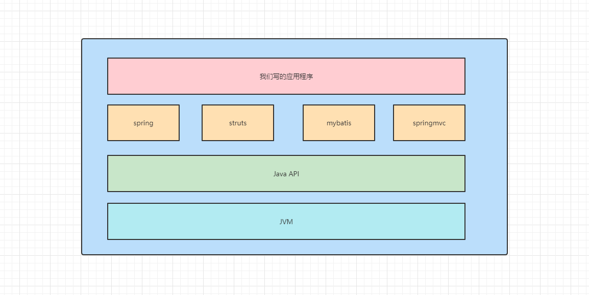
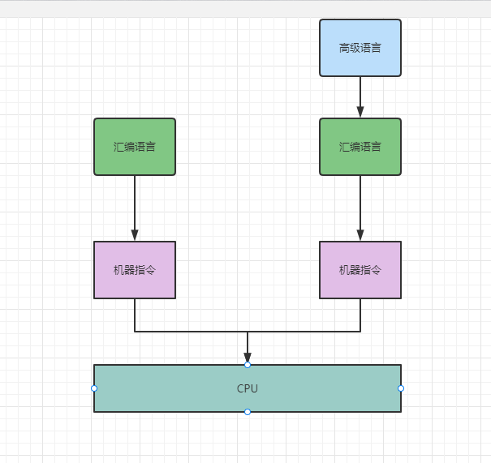
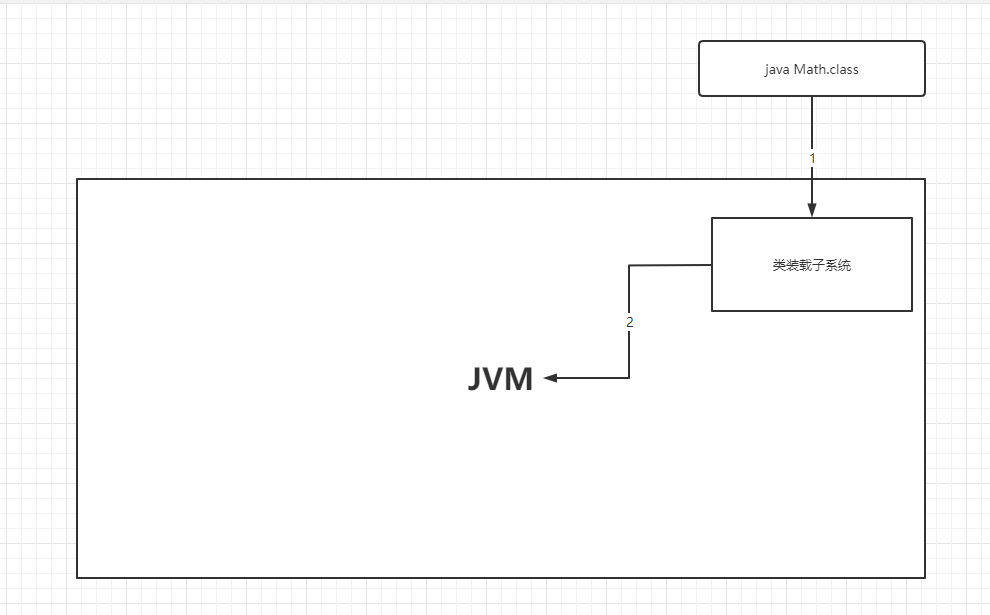
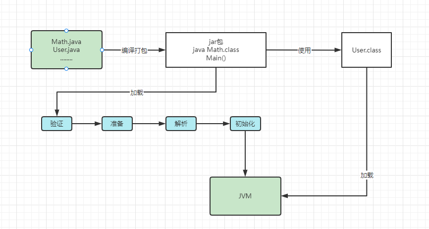
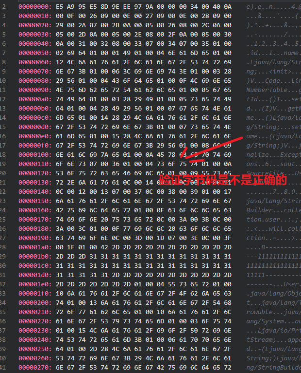
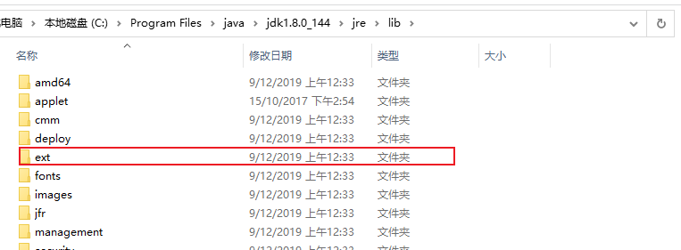
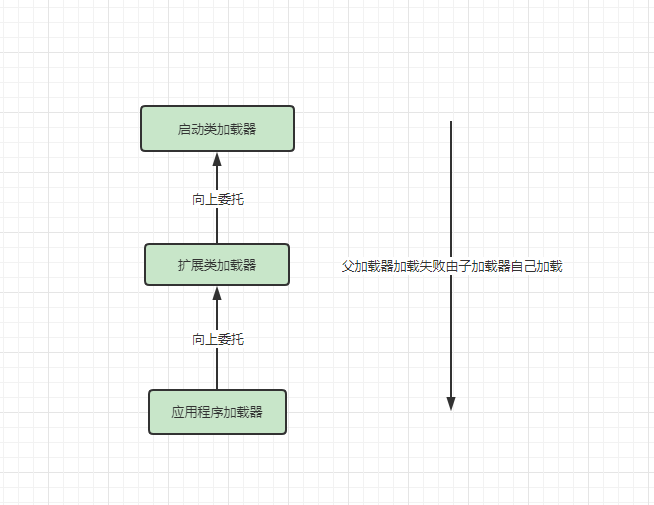

#### 1.1 jvm的意思
JVM=Java Vritual Machine = Java虚拟机

引入Java语言虚拟机后，Java语言在不同平台上运行时不需要重新编译。

Java语言使用Java虚拟机屏蔽了与具体平台相关的信息，使得Java语言编译程序只需要在Java虚拟机上运行的目标代码（字节码），就可以在多种平台上不加修改地运行。



#### 1.2 **为什么要学JVM呢**
1. 找Java相关的工作，面试是必问的。
1. 平台编写代码的时候，用的不是很多，但是在项目运行时，对JVM的一个调优设置。
1. JVM的知识点看起来是理论偏多，实操很少，而导致很容易忘记，这种情况越多，会让人感到挫败感。
1. 垃圾回收算法、JIT、底层原理、AOT

#### 1.3 我们写的应用程序

可以在图片上发现，JVM是处于最底层，我们平时的话，只接触上边的部分内容，最底下的很少去接触。那JVM不熟却是很正常的事情了。不用去焦虑



架构师每天都在思考什么？我目前还不是架构师，那我肯定不太清楚了。
* 应该如何让我的系统更快？
* 如何避免系统出现瓶颈？

**Java vs C++**
垃圾收集技术，Java是自动回收，C++自己去分配内存，自己去回收。
懂得JVM内部的内存结构、工作机制，是设计高扩展性应用和诊断运行时问题的基础，也是Java工程师进阶的必备能力。


类加载整体流程图



java里面主类在运行的过程中，如果使用到其他类，会逐步加载这些类。
注意，jar包里的类不是一次性全部加载的，是使用到时才加载。
```java
public class Math {

    public static void main(String[] args) {
        //开始是不会去加载的
        int j=1;
        int i=2;
        int c = i+j;
        //当执行到这一步的时候，才会去加载User.class字节码文件
        User user = new User();
    }
}
```

类加载到使用整个过程有如下几步：
加载 >> 验证 >> 准备 >> 解析 >> 初始化 >> 使用 >> 卸载

* 加载：在硬盘上查找并通过IO读入字节码文件，使用到类时才会去加载，例如调用类的main方法，new对象等等。
* 验证：校验字节码文件的正确性,下图是User.class字节码，vscode安装插件 hexdump for vscode

* 准备：把类的静态变量分配内存，并赋予默认值,下面的图里的静态变量默认值是null

* 解析：把符号引用替换为直接引用，该阶段会把一些静态方法（符号引用），比如main()方法替换为指向数据所存内存的指针或者句柄（直接引用），这就是所谓的静态链接过程（类加载期间完成），动态链接是在程序运行期间完成的将符号引用替换为直接引用。
* 初始化：对类的静态变量初始化为指定的值，执行静态代码块。

如果这个Math是继承其他类，那肯定是先加载父类。这里面还有一个知识点，父子类的先后加载顺序问题。

javap -c Math.class

类加载器和双亲委派机制
上面的类加载过程主要是通过类加载器来实现的，Java里有如下几种类加载器
* 启动类加载器**BootstrapClassLoader**：负载加载支撑JVM运行的位于负责加载存放在JDK\jre\lib(JDK代表JDK的安装目录，下同)下的核心类库，比如rt.jar、charsets.jar,比如Object类，String类啊。
* 扩展类加载器**ExtClassLoader**：负责加载JDK\jre\lib\ext目录中。

* 应用程序类加载器**AppClassLoader**：负载加载classPath路径下的类包，主要加载你自己写的那些类。
* 自定义加载器：负责加载用户自定义路径下的类包。



双亲委派机制，加载某个类时会先委托父加载器寻找目标类，找不到再委托上层父加载器加载，如果所有父加载器在自己的加载类路径下都找不到目标类，则 在自己的类加载路径中查找并载入目标类。
比如我们的Math类，最先会找应用程序类加载器加载，应用程序类加载器会先委托扩展类 加载器加载，扩展类加载器再委托启动类加载器，顶层启动类加载器在自己的类加载路径里 找了半天没找到Math类，则向下退回加载Math类的请求，扩展类加载器收到回复就自己加 载，在自己的类加载路径里找了半天也没找到Math类，又向下退回Math类的加载请求给应 用程序类加载器，应用程序类加载器于是在自己的类加载路径里找Math类，结果找到了就 自己加载了。。
**双亲委派机制说简单点就是，先找父亲加载，不行再由儿子自己加载**

打印当前类加载器
```java
ClassLoader classLoader = Thread.currentThread().getContextClassLoader();
System.out.println("name:"+classLoader);
```
结果
> name:sun.misc.Launcher$AppClassLoader@18b4aac2

那么如此类推，找到Bootstrap启动类加载器
```java
ClassLoader classLoader = Thread.currentThread().getContextClassLoader();
System.out.println("name:"+classLoader);
ClassLoader parentLoader = classLoader.getParent();
System.out.println("name:"+parentLoader);
ClassLoader grandLoader = parentLoader.getParent();
System.out.println("name:"+grandLoader);
```
结果
> name:sun.misc.Launcher$AppClassLoader@18b4aac2  
> name:sun.misc.Launcher$ExtClassLoader@7f31245a
> name:null

BootStrapClassLoader是null，在java是不存在是用C++去实现的。

自定义一个类加载器
```java

```

tomcat打破双亲委派机制
* 隔离不同应用：部署在同一个Tomcat中的不同应用A和B，例如A用了Spring2.5。B用了Spring3.5，那么这两个应用如果使用的是同一个类加载器，那么Web应用就会因为jar包覆盖而无法启动。
* 灵活性：Web应用之间的类加载器相互独立，那么就可以根据修改不同的文件重建不同的类加载器替换原来的。从而不影响其他应用。
* 性能：如果在一个Tomcat部署多个应用，多个应用中都有相同的类库依赖。那么可以把这相同的类库让Common类加载器进行加载。