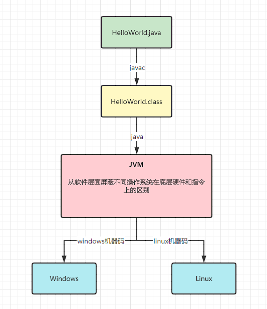
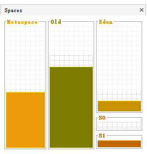
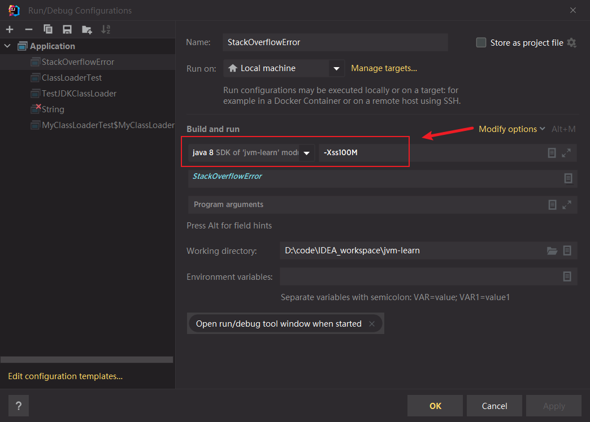
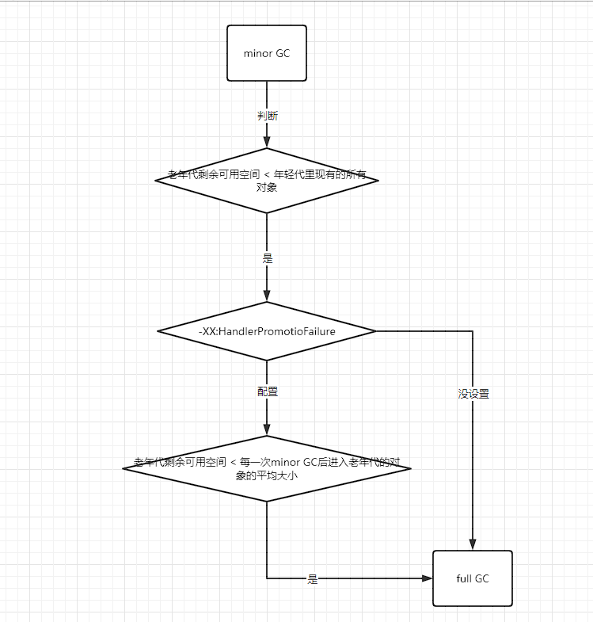

本地方法栈：
C语言在早期和java进行数据交互，就是用native这种本地方法进行交互。
那C语言也有局部变量，本地方法，那就是放在本地方法栈里面。

#### java语言的跨平台特性


堆：


Java visualVM的插件显示


#### JVM整体结构以及内存模型


##### JVM内存参数设置
假设设置堆为600M，默认情况下，老年代占400M，年轻带占200M，Eden区160M，From 20M，To 20M
运行时数据区：

Spring Boot程序的JVM参数设置格式（Tomcat启动直接加在bin目录下catalina.sh文件里）：
```powershell
java -Xms2048M -Xmx2048M -Xmn1024M -Xss512K -XX:MetaspaceSize=256M -XX:MaxMetaspaceSize=256M
-jar microservice-eureka-server.jar
```
关于元空间的JVM参数有两个：-XX:MetaspaceSize=N和-XX:MaxMetaspaceSize=N
-XX:MaxMetaspaceSize：设置元空间最大值，默认是-1，即不限制，或者说只受限于本地内存大小。
-XX:MetaspaceSize：指定元空间触发Fullgc的初始阀值（元空间无固定的初始大小），以字节为单位，默认是21M，达到该值就会触发full gc进行类型卸载，同时收集器会对该值进行调整；如果释放了大量的空间，就适当降低该值；如果释放了很少了的空间，那么在不超过-XX:MaxMetaspaceSize(如果设置了的话)的情况下，适当提高该值。这个跟早期jdk版本的-XX:PermSize参数意思不一样，-XX:PermSize代表永久代的初始容量。

由于调整元空间的大小需要Full GC，这是非常昂贵的操作，如果应用在启动的时候发生大量Full GC，通常都是由于永久代或元空间发生了大小调整，基于这种情况，一般建议在JVM参数中将MetaspaceSize和MaxMetaspaceSize设置成一样的值，并设置的比初始值要大，对于8G物理内存来说，一般设置256M。

##### StackOverflowError示例
```java
public class StackOverflowError {

    static int count=0;

    static void redo(){
        count++;
        redo();
    }

    public static void main(String[] args) {
        try{
            redo();
        }catch (Throwable throwable){
            throwable.printStackTrace();
            System.out.println(count);
        }
    }
}
运行结果：
	at StackOverflowError.redo(StackOverflowError.java:7)
	at StackOverflowError.redo(StackOverflowError.java:7)
	at StackOverflowError.redo(StackOverflowError.java:7)
	at StackOverflowError.redo(StackOverflowError.java:7)
	at StackOverflowError.redo(StackOverflowError.java:7)
23824
```

设置100M之后呢，最大值变成了**4962274**

-Xss设置越小 count值越小，说明一个线程能分配的栈帧就越小，但是对JVM整体来说能开启的线程数会更多

随着时间推移，会发生minor GC，回收无引用的对象，就是回收的那些垃圾对象，JVM会有垃圾回收线程去回收垃圾对象.(类加载，最后进入的就是图中JVM的方法区)

当年轻代经历15次的minor GC还存活，就会移到老年代。


minor GC和full GC都会STOP WORLD。如果不停止运行，垃圾收集的结果并不是正确的。
老年代最终也放满之后，最终会发出内存溢出对象。OOM

查看JVM的工具

visualVM还有jconsole

逃逸分析
JVM的运行模式
* 解释模式：只使用解析器，执行一行JVM字节码就编译一行为机器码（-Xint 强制JVM使用解释模式）
* 编译模式：只使用编译器，先将所有JVM字节码一次编译为机器码，然后一次性执行所有机器码（-Xcomp JVM使用编译模式）
* 混合模式：依然使用解释模式执行代码，但是对于一些热点代码采用编译模式执行，JVM一般采用混合模式执行代码

混合模式是JVM默认采用的执行代码方式，一开始还是解释执行，但是对于少部分“热点”代码会采用编译模式执行，这些热点代码对应的机器码会被缓存起来，下次再执行无需再编译，这就是我们常见的JIT即时编译技术。

**在即时编译过程中JVM可能会对我们的代码做一些优化，比如对象逃逸分析**

```java
public void test2(){
    User user = new Uesr();
    user.setId(1);
    user.setName("zhuge");
    //TODO 保存数据库
}
```
逃逸分析：就是分析对象动态作用域，当一个对象在方法中被定义后，它可能被外部方法所引用，例如作为调用参数传递到其他地方中。
逃逸分析参数开启（-XX:+DoEscapeAnalysis）,JDK之后默认开启逃逸分析。分析是在即时编译JIT产生的。

-XX:+PrintGCDetails
运行添加JVM参数


JVM根据系统信息，机器配置，自动设置配置

查看java进程
jps

查看java这个进程的信息
jmap -heap 进程id

查看堆的gc次数
jstat -gc pid

#### 大对象直接进入老年代
大对象就是需要大量连续内存空间的对象（比如：字符串、数组）。JVM参数 -XX:PretenureSizeThreshold可以设置大对象的大小，如果对象超过设置大小会直接进入老年代，不会进入年轻代，这个参数只在Serial和ParNew两个收集器下有效。
比如设置JVM参数： -XX:PretenureSizeThreshold=1000000 -XX:+UseSerialGC,再执行
为什么要这样呢？
为了避免为大对象分配内存时的复制操作而降低效率。

##### 长期存活的对象将进入老年代

##### 动态年龄判断机制
-XX:TargetSurvivorRatio
诸多对象年龄+：年龄1+年龄2+年龄3+....+年龄n > 50%
当前放对象的Survivor区域里，一批对象的总大小大于这块Survivor区域内存大小的50%，那么此时(年龄n和大于n的对象)大于等于这批对象年龄的最大值，就直接进入老年代

##### MinorGC后存活的对象Survivor区放不下

##### 老年代空间分配担保机制
老年代剩余可用空间，如果是小于年轻代现在的所有对象之和
担保机制：老年代是够放的。
-XX:HandlePromotionFailure 在JDK8是失效了，加到jvm options里，失效。



引用计数器法：当引用为0，就回收掉，但是这样是有问题的。
可达性分析算法：GC Roots的对象作为起点，从这些节点向下搜索，找到的对象都标记为非垃圾对象，其余未标记的对象都是垃圾对象。
GC Roots根节点：线程栈的本地变量、静态变量、本地方法栈的变量等等。

常用引用类型：
强引用、软引用、弱引用、虚引用

ThreadLocal的作用

finalize()方法最终判定对象是否存活。
在可达性分析算法中，不可达对象，也并非是非死不可的阶段，这时候处于暂缓执行。真正宣告一个对象死亡，至少要经历再次标记过程。

标记的前提是对象在进行可达性分析之后发现没有与之GC Roots相连接的引用链。
1、第一次标记并进行筛选
筛选条件是此对象是否有必要执行finalize()方法。
当对象没有覆盖finalize()方法，直接被回收
2、当覆盖了finalize的话
在finalize里面，自救一下，跟GC Root根联系一下。

如何判断一个类时无用的类
方法区主要回收的是无用的类，那么如何判断？
类需要同时满足下面3个条件才能算是 无用的类
* 该类所有的实例都已经被回收，也就是java堆中不存在该类的任何实例。
* 加载该类的ClassLoader已经被回收。
* 该类对应的java.lang.Class对象没有在任何地方被引用，无法在任何地方通过反射访问该类的方法。
