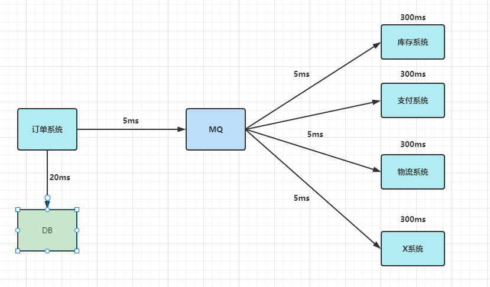
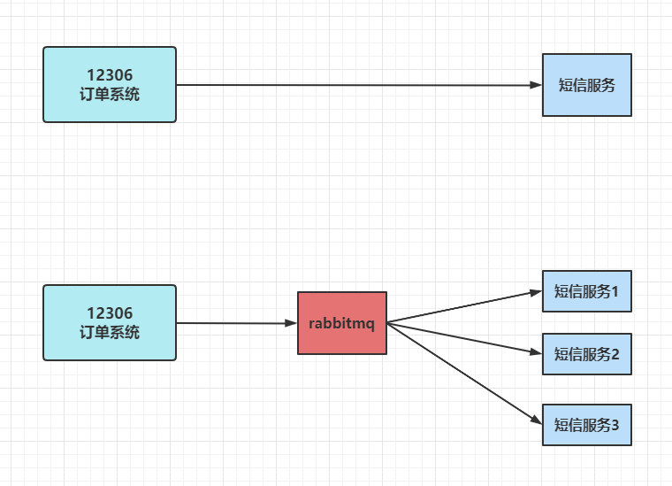

MQ全称：Messsage Queue（消息队列），是在消息传输的过程中保存消息的容器。多用于分布式系统之间通信。


#### MQ的优势
1.应用解耦

2.异步提速

3.削峰填谷


应用解耦：提高系统容错性和可维护性
异步提速：提升用户体验和系统吞吐量
削峰填谷：提高系统稳定性

RabbitMQ：Erlang，微秒级别，万级别，微秒级别
RocketMQ：阿里，java，单机吞吐量10万最好，毫秒级别
Kafka：Scala&Java 自定义协议，社区封装了http协议支持，10万级别次之，毫秒以内

AMQP：高级消息队列协议，是一个网络协议，是应用层协议的一个开放标准，为面向消息的中间件设计。


可靠性投递方法（分布式事务最终一致性解决方案）
1）：消息入库以及定时任务扫描方案
2）：延时检查方案

什么场景下用过mq？
秒杀，发短信，
可靠性投递你们用了什么方案

rabbitmq是通过elang（爱立信）语言开发的基于amqp协议
1）大公司都在采用
2）开源，更新快
3）。。。。。

概念：
server：又成为broker，一个项目连接一个virtual host，虚拟机里面有若干个exchange（交换机），exchange通过routingkey进行绑定queue。发消息带一个routingkey过来，通过这个进行路由发到不同的队列


Hello world

Work queue 


发布订阅模式pub sub
类似于redis的那种

短信通知服务



**直接交换机** 交换机---routingKey---队列queue
发送消息的时候，带入的那个的key跟routingKey一致 完全匹配。就发到那个queue队列里。

**topic交换机** 交换机-----tuling.key.* | #----队列

**Fanout交换机**，扇形交换机，队列只要跟交换机进行绑定，那么就说明我消息发送的时候全部会落入到对应的队列上。

哪一种性能最好，那肯定是扇形交换机，因为其他的两种都需要字符串匹配算法。

删除命令
```java
rabbitmqctl delete_user zhangsan
```
添加用户
```java
rabbitmqctl add_user zhangsan zhangsan
```

```java
rabbitmqctl set_user_tags zhangsan administrator
```
设置用户权限 
```java
set_permissions -p / zhangsan ".*" ".*" ".*"
```

一个工程中用一个虚拟主机。

启动rabbitmq命令
```java
systemctl start rabbitmq-server
```
