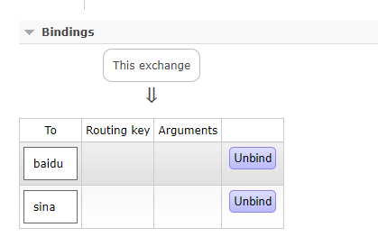
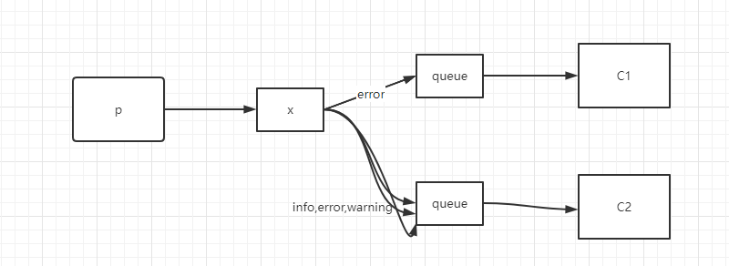
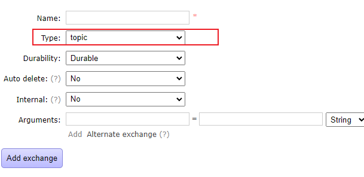

pub-sub 订阅模式

工作队列模式，不需要exchange交换机。producer发5000条，多个消费者去消费消费一部分，而订阅模式，producer发5000条，每个消费者都去消费5000条。

例如：中国气象局提供 **“天气预报”** 进入交换机，网易、新浪、百度、搜狐等门户接入通过队列绑定到该交换机，自动获取气象局推送的气象数据。

Exchange交换机：

* Fanout广播，将消息交给所有绑定到交换机的队列
* Direct定向，将消息交给符合指定routing key的队列
* Topic通配符，将消息交给符合routing pattern（路由模式）的队列

Exchange只负责转发，不具备存储消息的能力，因此如果没有任何队列与Exchange绑定，或者没有符合路由规则的队列，那么消息会丢失。

##### 4、Routing路由模式
* 队列与交换机的绑定，不能是任意绑定了，而是要指定一个RoutingKey（路由key）
* 消息的发送方在向Exchange发送消息时，也必须指定消息的RoutingKey
* Exchange不再把消息交给每一个绑定的队列，而是根据消息的Routing key进行判断，只有队列的Routing key完全一致，才会接收到消息

##### 5、topic通配符的模式
交换机类型设置为topic

* Topic类型与Direct相比，都是可以根据RoutingKey把消息路由到不同的队列。只不过Topic类型Exchange可以让队列在绑定Routing key的时候使用通配符

* RoutingKey一般都是有一个或多个单词组成，多个单词之间以“.”点号分割，例如：item.insert

* 通配符规则：# 匹配一个或多个词，* 匹配不多不少恰好一个词，例如：item.# 能够匹配
item.insert.abc 或者 item.insert ， item.* 只能匹配 item.insert,item.* 只能匹配 item.insert

####消息确认机制：
rabbitmq在传递消息的过程中充当了代理人（Broker）的角色，那生产者（Producer）怎样知道消息被正确投递到Broker了呢？
Rabbitmq提供了监听器（Listener）来接收消息投递的状态。
消息确认涉及两种状态：Confirm与Return

Confirm代表生产者将消息送到Broker时产生的状态，后续会出现两种情况：
-ack代表Broker已经将数据接收
-nack代表Broker拒收消息。原因有多种，队列已满，限流，IO异常

Return代表消息被Broker正常接收后（ack），但Broker没有对应的队列进行投递时产生的状态，消息被退回给生产者。

延时队列：rabbitmq不支持
ttl+死信队列=延时队列
界面设置virtual_host死信队列问题