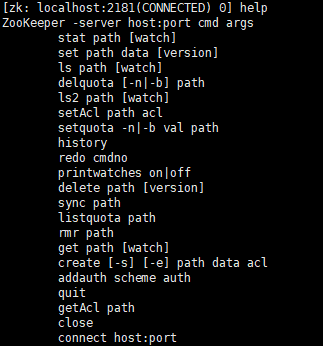
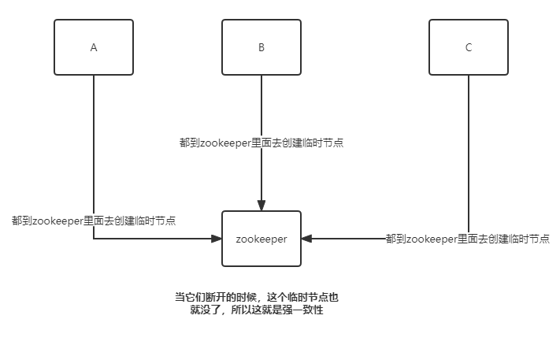
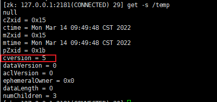

### 1.1 zookeeper概要

#### 1.1.1 zookeeper产生背景：
项目从单体到分布式转变之后，将会产生多个节点之间协同的问题。如：
1. 每天的定时任务由哪个节点来执行？
    1,2,3如何互相之间，进行心跳检测，成本很高啊，如果有10个节点呢
1. RPC调用时的服务发现？
    新增节点，怎么去发现，有的节点挂了怎么去发现呢
1. 如何保证并发请求的幂等性？
1. .......


这些问题可以统一归纳为多节点协调问题，如果靠节点自身进行协调这是非常不可靠的，性能上也不可取。必须由一个独立的服务做协调工作，它必须可靠，而且保证性能。

#### 1.1.2 zookeeper概要：
Zookeeper是用于分布式应用程序的协调服务。它公开了一组简单的API，分布式应用程序可以基于这些API用于同步，节点状态，配置等信息，服务注册等信息。其由java编写，支持Java和C两种语言的客户端。世界上最好的语言php是没法调用zookeeper的。

#### 1.1.3 znode节点
zookeeper中数据基本单元叫节点，节点之下可包含子节点，最后以树级方式呈现。每个节点拥有唯一的路径path。客户端基于path上传节点数据。zookeeper收到后会实时通知对该路径进行监听的客户端。


#### 1.1.4 部署与常规配置
zookeeper基于java开发，下载后只要有对应JVM环境即可运行。其默认端口号是2181运行前得保证其不冲突。

目前最新版本是3.8.0

```properties
# 心跳时间，基本单位
tickTime=2000
# 集群配置当中，follower初始化连接到leader的最大时长，tickTime的倍数
initLimit=10
# 数据同步的时候，最多允许的时间，tickTime的倍数
syncLimit=5
# 用来存储数据的地方
dataDir=/tmp/zookeeper
# 对客户端的端口号
clientPort=2181
# 服务器最大的连接数
#maxClientCnxns=60
#
# 默认保存3个快照
autopurge.snapRetainCount=3
# 自动触发清除任务时间间隔，小时为单位，默认为0，表示不自动清除。
autopurge.purgeInterval=1
```


close
表示关闭当前会话

delquota 
表示删除配额，-n删除数量，-b删除大小

getAcl
表示获取权限配置

history
查看历史操作记录

listquota
查看配额


### 1.2 zookeeper节点介绍
#### 1.2.1 节点类型
znode节点，没有目录，不能直接cd，znode包含了以下信息
* path:唯一路径
* childNode:子节点
* stat:状态属性（get -s）
* type:节点类型

**节点类型**
|类型|描述|
|  ----  | ----  |
|PERSISTENT|持久节点|
|PERSISTENT_SEQUENTIAL|持久序号节点|
|EPHEMERAL|临时节点（不可在拥有子节点）|
|EPHEMERAL_SEQUENTIAL|临时序号节点（不可在拥有子节点）|

临时节点只存储于会话期间，断开连接就销毁。序号节点，默认会在斜杠后面加上数字。

**临时节点的用途**


**持久节点的用途**
找服务的时候，一定是持久节点，底下就是临时节点，表示现有的多个相同的服务，具体的ip和端口

**序号节点**
可以节点分布式锁的问题，当有多个线程去对zookeeper创建序号节点，可以根据节点的大小决定是谁可以去秒杀

序号是根据cversion的变更去进行设置的，把c000000000的序号节点给删掉了，再次去创建c节点，删掉了，还是从1开始啊c00000000001

存数据是要经过编码和解码，所以看起来都是stirng类型。
**zookeeper的znode里面存储的是字节数组，可以存任意的对象。**

节点的属性里面ephemeralOwner不为空,不是0x0，就是临时节点，值是sessionId

|属性值|含义|
|-|-|
|cZxid|创建事务id，无论节点怎么变化，都不变|
|ctime|创建时间|
|mZxid|当我们节点的数据发生变更，变更的事务id是什么|
|mtime|最后修改时间|
|pZxid|子节点发生了变更，变更的子节点的事务id，只对应增加和删除|
|pZxid|子节点发生了变更，变更的子节点的事务id，只对应增加和删除|
|cversion|对应子节点对应的变更数量，只对应增加和删除才会变更|
|dataVersion|当前节点数据变更了，才会变更|
|aclVersion|access control list 权限访问列表。|
|ephemeralOwner|0x0表示是持久节点，其他的就是临时节点，表示创建人的sessionId|
|dataLength|数据长度|
|numChildren|子节点数量，不包括子子节点|
 
**节点监听**

|命令|描述|
| - | - |
| ls -w path | 监听子节点的变化（增，删） |
| get -w path | 监听节点数据的变化 |
| stat -w path | 监听节点属性的变化 |
| printwatches on 或者 off | 触发监听后，是否打印监听事件（默认on） |

zookeeper的watch，可以实现监听机制。无论在哪修改数据，其他节点都可以监听到。

监听是一次性的，一旦过期之后，要重新监听。如果早期要监听的话，触发一次事件之后，再去触发一次。
底层是用netty实现的。

监听子节点，添加子节点的需求：查看我们当前服务的机器有多少存活的，app目录是持久目录，会创建临时序号节点app00000001:ip,app00000002:ip,app00000003:ip,app00000004:ip 只要对app进行监听，就知道现在有多少台机器。

子节点数据的变更是不会影响，ls -w的监听
子节点的变更（增删）不会影响，stat的监听

**acl权限设置**
ACL全称是Access Control List（访问控制列表），用于控制资源的访问权限。Zookeeper使用ACL来控制对其znode的访问。基于scheme:id:permission的方式进行权限控制。scheme表示授权模式、id模式对应值、permission即具体的增删改权限位。

scheme：认证模型
|方案|描述|
| - | - |
| world | 开放模式，world表示全世界都可以访问 |
| ip | ip模式，限定客户端IP访问 |
| auth | 用户密码认证模式，只有在会话中添加了认证才可以访问。 |
| digest | 与auth类似，区别在于auth用明文密码，而digest用sha-1+base64加密后的密码。在实际使用中digest更常见。 |

permission权限位
|权限位|权限|描述|
| - | -|- |
| c | create | 可以创建子节点 |
| d | delete | 可以删除子节点（仅下一级节点）|
| r | read | 可以读取节点数据及显示子节点列表|
| w | write | 可以设置节点数据|
| a | admin | 可以设置节点访问控制列表权限|

acl相关命令
|命令|使用方式|描述|
| - | - |- |
| getAcl | getAcl path | 读取ACL权限 |
| setAcl | setAcl path acl | 设置ACL权限 |
| addauth | addauth scheme auth | 添加认证用户 |

world模式下，anyone：rwa