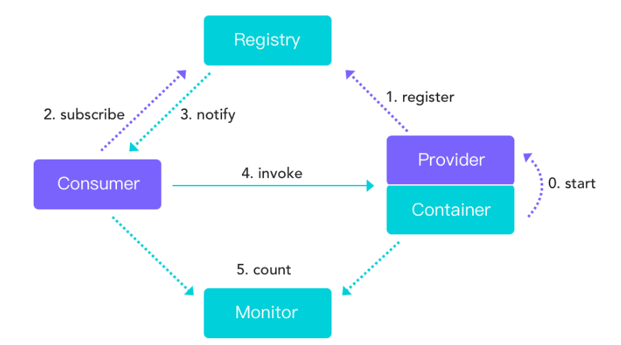

服务框架，使得应用可通过高性能的RPC实现服务的输出和输入功能，可以和spring框架进行无缝集成

出现分布式架构的原因：
1、稳定性和可用性这个两个指标很难达到，一旦大型主机出现故障，那整个系统都将处于不可用状态。
2、单机处理能力存在瓶颈
3、

远程调用方式

1. RMI，java远程方法调用、使用原生二进制方式进行序列化
1. Web Service，跨语言有SDK支持，发布繁琐
1. Http，采用http+json
1. Hessian，采用http+hessian实现

RMI远程调用：RMI是具体的实现
Java RMI，远程方法调用（Remote Method Invocation），RPC是一种抽象，没有具体的实现，一个JVM到另外一个JVM的调用。server直接把ip地址注入到register里面去，client从register拿到server信息，直接去调用。

Http+Nginx 方案总结：
优点：简单快速、几乎没有学习成本
适用场景：轻量级分布式系统、局部分布式架构。
弊端：运维是比较复杂的，所有的服务都要配置域名，服务多了，动态的改来改去是比较麻烦的。
相对于RMI架构：有负载均衡，服务发现，配置nginx的配置里面配置下就好了

dubbo+zookeeper：
可以动态的发现，服务上线和服务下线可以感知到，dubbo的协议是私有的协议，自定义协议。相比http+json的协议非常的轻量。
弊端：他不能够跨语言。可以http+nginx在和dubbo，混合使用。序列化的不一定是跨语言的。组件需要要嵌入到内部去，不能胯语言。

http+nginx，多了一层IO
dubbo，不需要多一层io，直接调用。

dubbo实现这么多，真正稳定可用的还是zookeeper
阿里自己不用，是因为服务太多了，zk是内存数据库，不可能存上亿的服务数据。

**服务端中最核心和最基础的4个对象**：
ApplicationConfig：设置一个应用名称，方便在控制台看
ProtocolConfig：设置代理的名称，还有端口
RegistryConfig：差不多就是空的
ServiceConfig：暴露服务export
1、配置 2、暴露

客户端：
ApplicationConfig
ReferencenConfig
1、配置 2、引用

#### java的spi机制
就是在resources文件夹下，META-INF/services,定义加载接口的全路径类名，里面是这个接口的实现类的全路径类名，在代码里面使用ServiceLoader去加载，就可以取出来对应的接口实现类，sql驱动就是这么实现的。
