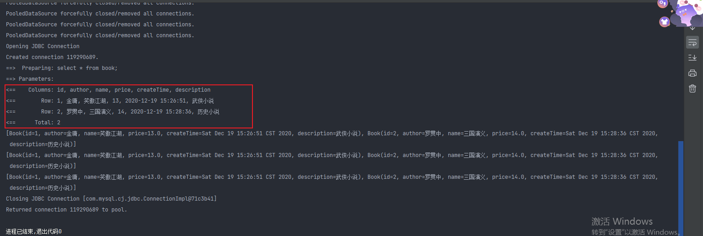
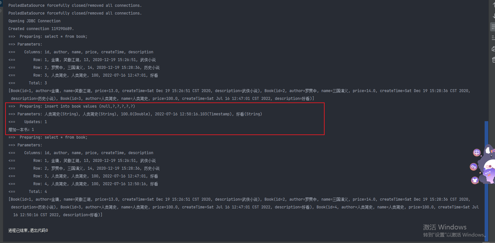

https://tech.meituan.com/2018/01/19/mybatis-cache.html

#### 一级缓存
在系统运行中，我们有可能在一次数据库会话中，执行多次查询条件完全相同的sql，mybatis提供了一级缓存的方案优化这部分场景，如果是相同的sql语句，会优先命中一级缓存，避免直接对数据进行查询，提高性能。

每个Sqlsession中持有了Executor，每个Executor中有一个LocalCache。当用户发起查询时，Mybatis根据当前执行的语句生成MappedStatement，在Local Cache进行查询，如果缓存命中的话，直接返回结果给用户，如果缓存没有命中的话，查询数据库，结果写入Local Cache，最后返回结果给用户。


在配置文件中设置，开启
```java
<setting name="localCacheScope" value="SESSION"/>
```

可以看到第一次查了，后来都没查，取得都是LocalCache


##### 一级缓存失效1

在sqlSession查询之后，再去新增，再去查询，发现一级缓存失效



##### 一级缓存失效2

两个sqlsession，在sqlsession中查询数据，使一级缓存生效，在sqlsession中更新数据库，验证一级缓存只在数据库会话中内部共享。


##### 一级缓存工作流程时序图

##### 缓存命中

```mermaid
sequenceDiagram
    participant Client
    participant Sql session
    participant Executor
    participant Cache
    Client->>Sql session: select
    Sql session->>Executor: query
    Executor->>Cache: localCache.getObject(key)
    Cache-->>Executor: 返回查询结果
    Executor->>Executor: 判断查询结果是否为null，不为null继续往下走，不查数据库
    Executor-->>Sql session: 返回查询结果
    Sql session-->>Client: 返回Cache查到的值
```
##### 缓存未命中

```mermaid
sequenceDiagram
    participant Client
    participant Sql session
    participant Executor
    participant Cache
    participant DB
    Client->>Sql session: select
    Sql session->>Executor: query
    Executor->>Cache: localCache.getObject(key)
    Cache-->>Executor: 返回查询结果
    Executor->>Executor: 判断查询结果是否为null
    Executor->>DB: dispatch
    DB-->>Executor: return
    Executor-->>Sql session: 返回查询结果
    Sql session-->>Client: 返回Cache查到的值
```