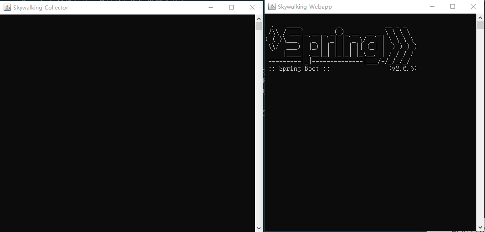

对于一个大型的几十个、几百个微服务构成架构系统，通常会遇到下面一些的问题。

1.如何串联整个调用链路，快速定位问题？
2.如何清理各个微服务之间的依赖关系？
3.如何进行各个微服务接口的性能分析？
4.如何跟踪整个业务流程的调用处理顺序？

官网：https://skywalking.apache.org/

##### 调用链选型：
Zipkin：Twitter开源的调用链分析工具  中国人寿项目 邮箱接入的是Zipkin 
Pinpoint：韩国人开源的基于字节码注入的调用链分析，以及应用监控分析工具。  
Skywalking：国产化本土开源基于字节码注入的调用链分析，应用监控分析工具。加入apache
CAT：大众点评开源的基于编码和配置的调用链分析，应用监控分析，日志采集，监控报警一系列。。。

Skywalking是达到方法级别。JVM监控

支持Java，.NET Core Node.js

java agent java探针

部署两个服务（）

##### 项目启动
***
1. 进入config文件夹修改application.yml,改成elasticsearch


2. 进入webapp文件夹修改webapp.yml,改成port
```java
改成9010
```


3. 进入bin目录，启动startup.bat【还需要启动es】


**如果将当前项目放置在有空格的目录中，会导致启动失败**
