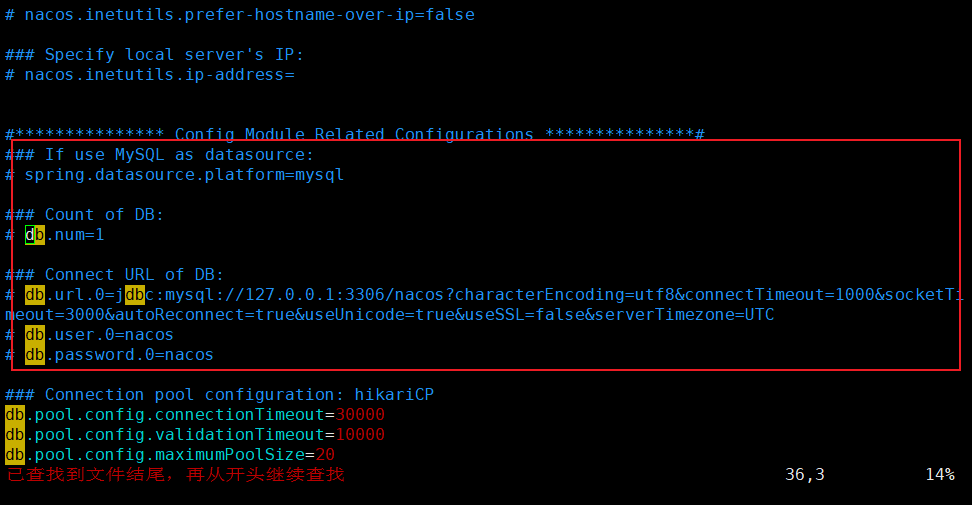

主要功能：
1. 动态配置服务
1. 服务发现与管理
1. DNS
访问地址 http://start.spring.io/actuator/info
看看版本对应

CS架构。

在start.cmd里面把集群模式改成standlone

启动端口是8848

把服务拉到本地来，是有一个接口的：openapi
```java
/nacos/v1/ns/service/list
```

注册instance是什么存储的？ 临时节点存在内存 持久节点持久化到磁盘文件 data/naming/namespace的id    
配置数据是什么存储的  derby mysql

nacos集群：会相互同步服务实例，保证服务的一致性，raft协议，CP，有一个leader

nacos：拉取 持久实例和临时实例是一次性拉取的  
naming-server【namingservice】：注册服务

心跳：服务续约，客户端向服务端定时发心跳，服务端接收到心跳后修改服务的续约时间
lastregistrytime：  
9:00 15s  
9:15 15s  
服务端服务剔除：  
currenttime-lastregistrytime>15s 修改存活状态 down  

currenttime-lastregistrytime>15s delete  

阈值保护   down(的节点数量)/all(的节点数量) < 阈值  

上传到linux服务器。然后以standalone模式启动，然后在rabbon的项目里，集成nacos-client。然后去调用访问。
引入cloud-nacos的maven配置
```java
<parent>
    <groupId>org.springframework.boot</groupId>
    <artifactId>spring-boot-starter-parent</artifactId>
    <version>2.3.2.RELEASE</version>
    <relativePath/> <!-- lookup parent from repository -->
</parent>
<spring.cloud.alibaba.version>2.2.5.RELEASE</spring.cloud.alibaba.version>
<dependency>
    <groupId>com.alibaba.cloud</groupId>
    <artifactId>spring-cloud-alibaba-dependencies</artifactId>
    <version>${spring.cloud.alibaba.version}</version>
    <type>pom</type>
    <scope>import</scope>
</dependency>

<dependency>
    <groupId>com.alibaba.cloud</groupId>
    <artifactId>spring-cloud-starter-alibaba-nacos-discovery</artifactId>
</dependency>
#这个里面依赖nacos-client
```
在yml文件配置：
```java
spring:
  application:
    name: ribbon-application
  cloud:
    nacos:
      discovery:
        server-addr: 192.168.125.60:8848
```
启动springboot，就可以看到nacos里面的服务者列表，收到注册信息

如果在consumer里面，autowired，LoadBalancerClient 那应该是maven没有配置好

依赖ribbon之后，使用restTemplate是不能直接访问ip:port的，要加服务名称。实验来的，在ribbon-consumer里面，consumer1是访问失败的，可能是它实现了restTemplate的interceptor接口。把mail-service 转换成 ip:port


设置临时实例和健康状态的配置
```java
spring:
  application:
    name: ribbon-application
  cloud:
    nacos:
      discovery:
        server-addr: 192.168.125.60:8848
        # 临时节点，持久节点（信息存到磁盘里）
        ephemeral: false
```
健康状态是，server跟client保持心跳连接  
nacos的健康实例是怎么设置的？  
删除持久节点健康实例，需要调openapi接口，再去删除。
http://127.0.0.1:8848/nacos/v1/ns/instance?serviceName=security-order&ip=192.168.40.141&port=8965&clusterName=DEFAULT&ephemeral=false   【delete】  


启动nacos-server的命令
```java
bin/startup.sh ‐m standalone
```
nacos的数据库文件：nacos-mysql.sql  
修改mysql的配置文件：

访问地址：http://192.168.125.60:8848/nacos/#/login  

在RestTemplate扩展点里面有一个接口，ClientHttpRequestInterceptor    
Ribbon是实现了这个扩展，LoadBalancerInterceptor实现这个扩展点  
mall-order --------> localhost:8020 
http://mail-order -----------> localhost:8020  


服务实例内部注册表  
Map(namespace,Map(gourp::serviceName,Service))
namespace: 隔离的作用  
group:serviceName: 隔离作用 group 所有服务用同一个gourp   （配置中心，起到环境隔离的作用）

Service #就是一个微服务  
Map<String,Cluster> clusterMap #集群 BJ SH（ribbon 负责均衡算法：优先使用同一集群的节点）

private Set<Instance> persistenInstances = new HashSet<Instance>();  #持久实例  
private Set<Instance> ephemeralInstances = new HashSet<Instance>();  #临时实例  
临时实例，存到内存
持久实例，存到磁盘


