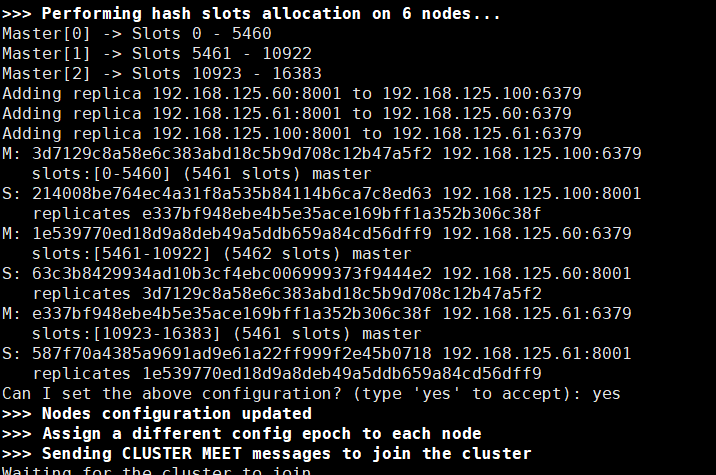

**在哨兵集群切换主节点的时候，有几秒到几十秒是不可用的。**
对外提供同时写的，只有一个主节点，单节点最多只有几万qps（10万）。
redis单节点推荐配置10个G，会有主从风暴的问题。 会导致持久化文件过大，影响数据恢复或主从同步的效率。


redis集群要求至少3个主节点，
对于redis从节点，是不允许读的，纯粹是备份。
架构（3主+3从）
```java
cluster-enabled yes(启动集群模式)
cluster-config-file nodes-8001.conf(集群节点信息文件，这里800x最好和port对应上)
cluster-node-timeout 5000

requirepass zhuge(设置redis访问密码)
masterauth zhuge(设置集群节点间访问密码，跟上面一致)
```

构建cluster
```java
./redis-cli --cluster help //查看帮忙中心

/usr/local/redis‐5.0.3/src/redis‐cli ‐a zhuge ‐‐cluster create --cluster-replicas 1 192.168.0.61:8008 192.168.0.61:8001 192.168.0.61:8002 192.168.0.61:8003 192.168.0.61:8004 192.168.0.61:8005 192.168.0.61:8004 
//1表示配置多少个小集群的主从节点

```

会把所有可用的主节点，映射到逻辑上的16384的slot槽里面。通过hash算法。每个主节点均分一下Hash slot=CRC16(key)%16384

```java
./redis-cli -a zhuge -c -h 192.168.125.51 -p 8001
```

redis组成cluster集群，会把同一台机器上的主从错开。目的是防止这一台机器挂了，导致了整个小集群都挂了，而导致整个集群不可用，不对外提供服务。
redis cluster会把集群信息写到配置文件里面。第一个创建集群之后，就不用再create，只需要把单个节点再次集群，他们会相互通信，根据写到配置文件的信息自动识别。只要把主节点启动就好了。


在搭建cluster集群的时候，实验证明是不需要配置replicaof的。
还有要确保不是保护模式，密码有时候，还需要通过命令去设置。
```java
先通过无密码启动
config set requirepass zhuge
```

输入yes


验证集群  
1. 连接任意一个客户端即可：./redis-cli -c -h 192.168.125.60 -p 8001 -a zhuge  
1. 进行验证：cluster info（查看集群消息）、cluster nodes(查看集群列表)


jedis连接cluster
springboot连接cluster

干掉一个主节点，测试，从节点被选举为主节点。再重启被kill的主节点，它变为从节点。
集群的选举比哨兵快一点，简洁一些。

客户端分片的源码。
分片算法。
```java
String key = "hongmi";
String value = "k30";
String key16= JedisClusterHashTag.getHashTag(key);
System.out.println( getCRC16(key) & 16383);
```

Redis集群原理分析
Redis Cluster将所有数据划分为16384个slots（槽位），每个节点负责其中一部分槽位。槽位的信息存储于每个节点中。当Redis Cluster的客户端来连接集群时，它也会得到一份集群的槽位配置信息，并将其缓存在客户端本地，这样当客户端要查找某个key时，可以直接定位到目标节点。同时因为槽位的信息可能会存在客户端与服务器不一致的情况，还需要纠正机制来实现槽位信息的校验调整。

槽位定位算法
Cluster默认会对key值使用crc16算法进行hash得到一个整数值，然后用这个整数值对16383进行与运算来得到具体槽位。
```java
getCRC16(key) & 16383
```

跳转重定位
当客户端向一个错误的节点发出了指令，该节点会发现指令的key所在的槽位并不归自己管理，这时它会向客户端发送一个特殊的跳转指令携带目标操作的节点地址，告诉客户端去连这个节点去获取数据。客户端收到指令后除了跳转到正确的节点上去操作，还有同步更新纠正本地的槽位映射表缓存，后续所有的key将使用新的槽位映射表。

Redis集群节点间的通信机制
redis cluster节点间采取gossip协议进行通信
* 维护集群的元数据（集群节点信息，主从角色，节点数量，各节点共享的数据等）有两种方式：集中式和gossip

集中式：优点在于元数据的更新和读取，时效性非常好，一旦元数据


debug，jedis连接cluster设置值