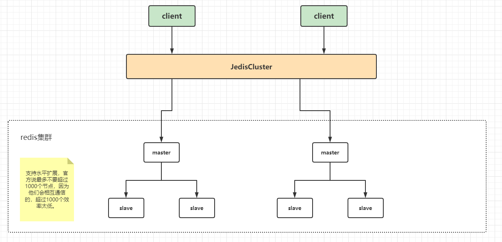

**在哨兵集群切换主节点的时候，有几秒到几十秒是不可用的。**
对外提供同时写的，只有一个主节点，单节点最多只有几万qps（10万）。
redis单节点推荐配置10个G，会有主从风暴的问题。 会导致持久化文件过大，影响数据恢复或主从同步的效率。


redis集群要求至少3个主节点，
对于redis从节点，是不允许读的，纯粹是备份。
架构（3主+3从）
```java
cluster-enabled yes(启动集群模式)
cluster-config-file nodes-8001.conf(集群节点信息文件，这里800x最好和port对应上)
cluster-node-timeout 5000

requirepass zhuge(设置redis访问密码)
masterauth zhuge(设置集群节点间访问密码，跟上面一致)
```

构建cluster
```java
./redis-cli --cluster help //查看帮忙中心

/usr/local/redis‐5.0.3/src/redis‐cli ‐a zhuge ‐‐cluster create --cluster-replicas 1 192.168.0.61:8008 192.168.0.61:8001 192.168.0.61:8002 192.168.0.61:8003 192.168.0.61:8004 192.168.0.61:8005 192.168.0.61:8004 
//1表示配置多少个小集群的主从节点

```

会把所有可用的主节点，映射到逻辑上的16384的slot槽里面。通过hash算法。每个主节点均分一下Hash slot=CRC16(key)%16384

```java
./redis-cli -a zhuge -c -h 192.168.125.51 -p 8001
```